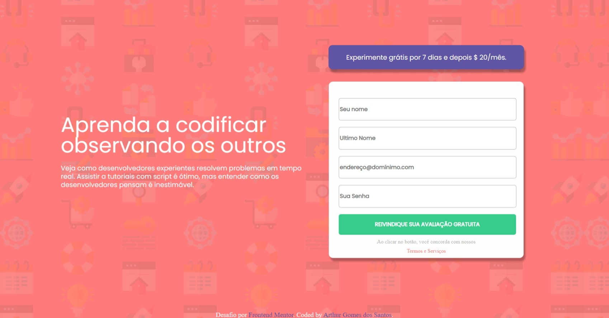

# Validação JavaScript

Esse é um desafio da equipe Frontend Mentor que ajudam a melhorar as suas capacidades de codificação através da construção de projetos realista.

## índice

- [Visão Geral](#visão-geral)
  - [O Desafio](#o-desafio)
  - [Captura de ecrã](#screenshot)
  - [Links](#links)
  - [Construído com](#Construído-com)
  - [O que aprendi](#O-que-aprendi)
  - [Recursos utilizados](#recursos-utilizados)
- [Eu](#eu)
- [Agradecimentos](#Agradecimentos)

## Visão Geral

### O Desafio

Os utilizadores devem ser capazes de o fazer:

- Ver o layout ótimo do site, independendo do tamanho do ecrã do seu dispositivo
- Ver os estados de flutuação para todos os elementos interativos na página
- Receber uma mensagem de erro quando o `formulário` é submetido se:
  - Qualquer campo `input` estiver vazio. A mensagem para este erro deve dizer _"[Nome do campo] não pode estar vazio"_"[Nome do campo].
  - O endereço de correio electrónico não está formatado correctamente (ou seja, um endereço de correio electrónico correcto deve ter esta estrutura: `name@host.tld`). A mensagem para este erro deve dizer _"Parece que isto não é um e-mail"_

### Screenshot

### Links

- Solution URL: [https://github.com/Arttutu/formulario-js]
- Live Site URL: [https://arttutu.github.io/formulario-js/]

### Construído com

- HTML5
- CSS
- Flexbox
- CSS Grid
- Regex
- Mobile-first workflow

### O que aprendi

Aprendi a utilizar CSS Grid para dispor os elementos na tela, também utilizei pela primeira vez as váriaveis CSS, e por ultimo aprendi a utilizar o javascript para fazer validação no formulário HTML.

### Recursos utilizados

- [Example resource 1](https://regex101.com/) - Esse site incrível me ajudou a construir minha expressão regular, que foi fundamental para eu conseguir fazer a validação do e-mail.
- [Example resource 2](https://www.alura.com.br/) - Essa é uma maravilhosa plataforma de estudos online, que me ajudou a entender melhor os conceitos de flexbox e CSS grid.

## Eu

- Website - [ Arthur Gomes dos Santos](https://arttutu.github.io/meu_portfolio/)
- Frontend Mentor - [@Arttutu](https://www.frontendmentor.io/profile/Arttutu)
- github - [@Arttutu](https://github.com/Arttutu)
  -linkedin - [Arthur Gomes](https://www.linkedin.com/in/santos-gomes/)

## Agradecimentos

Quero agradeçer a Ana clara por te me aprensentado a plataforma @FrontendMentor.
